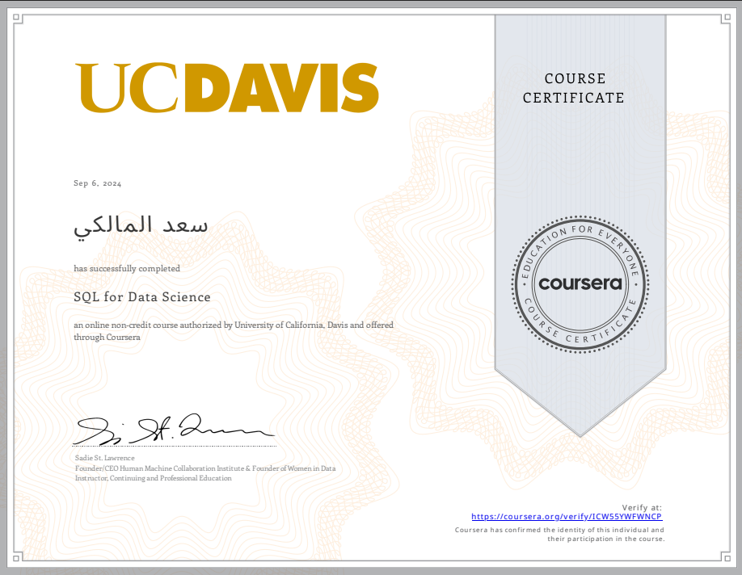

# UC Davis - SQL for Data Science
I'm finished this course in `Septermber 2024` But this repository for the final project of this course.

## To setup final project
Follow `Final Project Instructions with Step-by-Step Images.pdf` step by step to get a full tutorial , then using `SQLite` or any RDBMS you want , To create database using `content.sql` and loading contents with CSVs files.

## Course Info
#### SQL for Data Science is online-course authorized by University of California, Davis and offered
#### through Coursera. The course is part from **Learn SQL Basics for Data Science Specialization**.
---

[Course link](https://www.coursera.org/learn/sql-for-data-science)

#### My certification
Date : 6 Sep 2024

###### Credits :
**0xSaad/Saad Almalki**
- [X.com](https://x.com/0xdonzdev)
- [Github](https://github.com/Saad711T)
- [Linkedin](https://www.linkedin.com/in/saadalmalki711)
